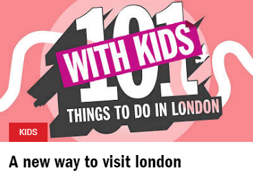
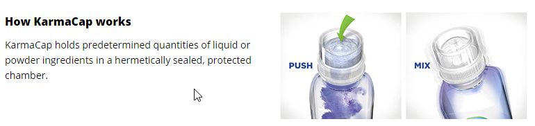
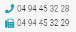
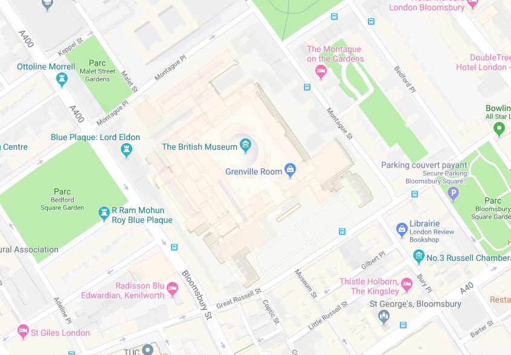
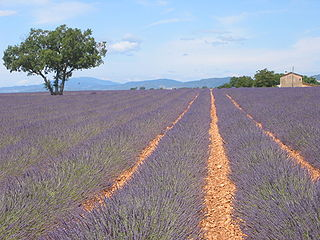

<header>
# Image conveying information
{: .article-header__title}
</header>

**Impact:** Major

**Users mainly impacted:** Blind, severely visually impaired.

**RGAA criteria:** [Criterion 1.3 [A]](http://disic.github.io/rgaa_referentiel_en/criteria.html#crit-1-3) - [Criterion 1.6 [A]](http://disic.github.io/rgaa_referentiel_en/criteria.html#crit-1-6) - [Criterion 1.7 [A]](http://disic.github.io/rgaa_referentiel_en/criteria.html#crit-1-7)
{: .criteria }

## Relevant alternative

To be accessible, the alternative of an image **must be relevant**. It must provide the information conveyed by the image to the user, taking its context into account.
The alternative of an image must be short and concise, in other words, not exceeding 80 characters. If it is too long, it is necessary to make a long description ([See the example of a complex image](#complex-images-the-detailed-description)).

<div class="tip">
<svg role="img" aria-label="Tip" xmlns="http://www.w3.org/2000/svg" viewBox="0 0 352 512" width="28" height="40"><title>Tip</title><path d="M96.06 454.35c.01 6.29 1.87 12.45 5.36 17.69l17.09 25.69a31.99 31.99 0 0 0 26.64 14.28h61.71a31.99 31.99 0 0 0 26.64-14.28l17.09-25.69a31.989 31.989 0 0 0 5.36-17.69l.04-38.35H96.01l.05 38.35zM0 176c0 44.37 16.45 84.85 43.56 115.78 16.52 18.85 42.36 58.23 52.21 91.45.04.26.07.52.11.78h160.24c.04-.26.07-.51.11-.78 9.85-33.22 35.69-72.6 52.21-91.45C335.55 260.85 352 220.37 352 176 352 78.61 272.91-.3 175.45 0 73.44.31 0 82.97 0 176zm176-80c-44.11 0-80 35.89-80 80 0 8.84-7.16 16-16 16s-16-7.16-16-16c0-61.76 50.24-112 112-112 8.84 0 16 7.16 16 16s-7.16 16-16 16z"/></svg>
To know if an image is decorative or informative, hide it, take into account the context and ask yourself the question:<br>**Did I lose any information?**<br>If so, this image conveys information.
</div>

### Synthesis
* Always take into account the context;
* Do not make redundant content;
* Create a long description if the alternative exceeds 80 characters;
* Never extrapolate the meaning of an image.

## Examples

### Images that contain text



In this example, the image conveys an information in text form. First, let's check the context.
In this case, the context does not convey the same content as the image.
If we hide the image, some information is lost. Therefore it is necessary to add an alternative such as "101 things to do in London with kids".

```html

<p class="category">Kids</p>
<h3>A new way to visit london</h3>
```

### Images that represent a scene or an action

In this case, if the information is essential to understanding, you must describe it in the alternative text.



The context does not allow to understand the meaning of the images.
On the first image, the alternative should be "Push down on the top of the cap to release the contents", and on the second "and mix the ingredients".

```html
<h2>How KarmaCap works</h2>
<p>KarmaCap holds predetermined quantities of liquid or powder ingredients in a hermetically sealed, protected chamber.</p>


```

<div class="important">
<svg role="img" aria-label="Important" xmlns="http://www.w3.org/2000/svg" viewBox="0 0 576 512" width="40" height="36"><title>Important</title><path d="M569.517 440.013C587.975 472.007 564.806 512 527.94 512H48.054c-36.937 0-59.999-40.055-41.577-71.987L246.423 23.985c18.467-32.009 64.72-31.951 83.154 0l239.94 416.028zM288 354c-25.405 0-46 20.595-46 46s20.595 46 46 46 46-20.595 46-46-20.595-46-46-46zm-43.673-165.346l7.418 136c.347 6.364 5.609 11.346 11.982 11.346h48.546c6.373 0 11.635-4.982 11.982-11.346l7.418-136c.375-6.874-5.098-12.654-11.982-12.654h-63.383c-6.884 0-12.356 5.78-11.981 12.654z"/></svg>
It is important to remember that images do not necessarily have to be described in detail. Never extrapolate the meaning of the image. You must convey sufficient and necessary information.
</div>

### Images that represent a graphic



In this case without alternative, it is impossible to distinguish between the telephone number and the fax number.
In any case, if the graphical display of a telephone is used, it is necessary to provide this information via an alternative.

#### With icon font
<p>
    <span class="fas fa-phone" role="img" aria-label="Phone"></span>
    <span class="text">04 94 45 32 28</span>
</p>
<p>
    <span class="fas fa-fax" role="img" aria-label="Fax"></span>
    <span class="text">04 94 45 32 29</span>
</p>

```html
<p>
    <span class="fas fa-phone" role="img" aria-label="Phone"></span>
    <span class="text">04 94 45 32 28</span>
</p>
<p>
    <span class="fas fa-fax" role="img" aria-label="Fax"></span>
    <span class="text">04 94 45 32 29</span>
</p>
```

#### With SVG
```html
<p>
    <svg role="img" aria-label="phone" xmlns="http://www.w3.org/2000/svg" viewBox="0 0 512 512">
        <title>Phone</title>
        <path fill="currentColor" d="M493.4 24.6l-104-24c-11.3-2.6-22.9 3.3-27.5 13.9l-48 112c-4.2 9.8-1.4 21.3 6.9 28l60.6 49.6c-36 76.7-98.9 140.5-177.2 177.2l-49.6-60.6c-6.8-8.3-18.2-11.1-28-6.9l-112 48C3.9 366.5-2 378.1.6 389.4l24 104C27.1 504.2 36.7 512 48 512c256.1 0 464-207.5 464-464 0-11.2-7.7-20.9-18.6-23.4z" class=""></path>
    </svg>
    <span class="text">04 94 45 32 28</span>
</p>
<p>
    <svg role="img" aria-label="fax" xmlns="http://www.w3.org/2000/svg" viewBox="0 0 512 512">
        <title>Fax</title>
        <path fill="currentColor" d="M480 160V77.25a32 32 0 0 0-9.38-22.63L425.37 9.37A32 32 0 0 0 402.75 0H160a32 32 0 0 0-32 32v448a32 32 0 0 0 32 32h320a32 32 0 0 0 32-32V192a32 32 0 0 0-32-32zM288 432a16 16 0 0 1-16 16h-32a16 16 0 0 1-16-16v-32a16 16 0 0 1 16-16h32a16 16 0 0 1 16 16zm0-128a16 16 0 0 1-16 16h-32a16 16 0 0 1-16-16v-32a16 16 0 0 1 16-16h32a16 16 0 0 1 16 16zm128 128a16 16 0 0 1-16 16h-32a16 16 0 0 1-16-16v-32a16 16 0 0 1 16-16h32a16 16 0 0 1 16 16zm0-128a16 16 0 0 1-16 16h-32a16 16 0 0 1-16-16v-32a16 16 0 0 1 16-16h32a16 16 0 0 1 16 16zm0-112H192V64h160v48a16 16 0 0 0 16 16h48zM64 128H32a32 32 0 0 0-32 32v320a32 32 0 0 0 32 32h32a32 32 0 0 0 32-32V160a32 32 0 0 0-32-32z" class=""></path>
    </svg>
    <span class="text">04 94 45 32 29</span>
</p>
```

### Complex images: the detailed description

Alternative text should only be used for images that can be easily described in a sentence.

In the case of a complex image such as a data graph or computer graphics, a detailed description must be provided via a paragraph under that image.

There are several ways to add a detailed description, here are the most common ones:

* Add a paragraph directly below the image;
* Add an adjacent link, before or after to the detailed description;
* The least robust, add a `longdesc` attribute with a URL to the detailed description.

To allow a screen reader user to link your image to its detailed description, you will proceed as follows:

* Add an alternative text to the image without describing it, but indicating that there is a description. For example: Access map (see description below);
* At the beginning of the detailed description, you will take up this title again. For example: "Access map (detailed description): To access...".

When facing an image with a detailed description, a question must be asked:

**What information does this image want to convey?**

For example for a map, it is useless to describe all the streets, parking, buildings... It is necessary to understand the meaning and interest of this map.

#### Example of complex image with detailed description

Below is an example of a complex image. This is a location plan. An alternative text is not sufficient to transcribe all the information on this plan.



**Detailed description of the access map to the British Museum**

The entrance to the museum is accessible from the Great Russell street.

From the Bloomsbury street, go down to the Great Russell street and take on your left.

From the Montague street, go down to the Great Russell street and take on your right.

## Received ideas

### Do not extrapolate the information conveyed by the images



In this example, the `alt` of the image is 'Lavender fields in the south of France'.
No information in the image allows to affirm that we are in the south of France. It is not relevant to specify this.

### The image alternative must not be used to mention the credits (author, date, etc.) of the image

If you are crediting an image, you should not use the image replacement text. First of all, it means that not everyone has access to this information. Second, the alternative text is used to describe the image, not to assign it.
In the specific case of credits, the use of a legend is the most appropriate.

<div class="tip">
<svg role="img" aria-label="Tip" xmlns="http://www.w3.org/2000/svg" viewBox="0 0 352 512" width="28" height="40"><title>Tip</title><path d="M96.06 454.35c.01 6.29 1.87 12.45 5.36 17.69l17.09 25.69a31.99 31.99 0 0 0 26.64 14.28h61.71a31.99 31.99 0 0 0 26.64-14.28l17.09-25.69a31.989 31.989 0 0 0 5.36-17.69l.04-38.35H96.01l.05 38.35zM0 176c0 44.37 16.45 84.85 43.56 115.78 16.52 18.85 42.36 58.23 52.21 91.45.04.26.07.52.11.78h160.24c.04-.26.07-.51.11-.78 9.85-33.22 35.69-72.6 52.21-91.45C335.55 260.85 352 220.37 352 176 352 78.61 272.91-.3 175.45 0 73.44.31 0 82.97 0 176zm176-80c-44.11 0-80 35.89-80 80 0 8.84-7.16 16-16 16s-16-7.16-16-16c0-61.76 50.24-112 112-112 8.84 0 16 7.16 16 16s-7.16 16-16 16z"/></svg>
[How to integrate icons in an accessible way](../../techniques/accessible-icons.html).
</div>

### Functional image

An image can be used in a link, input, button and other interactive elements. In this case, the image alternative must convey the function and the destination.
For example, a link on a thumbnail that opens the enlarged version of an image in a modal window, the alternative will not be a description of the image but the action of opening the image.

*[SVG]: Scalable Vector Graphics
