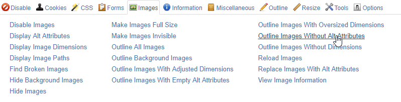
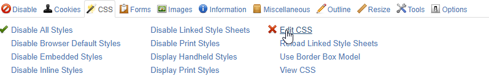

<header>
## Criterion 1.1 [A] Does each image have a [text alternative](../../glossary.html#mAltTexteImg)?
{: .article-header__title}
</header>

### Explanation

All images must have an alt attribute, which is due to the fact that in the absence of this attribute, a screen reader returns the path or name of the source file, which makes no sense to the user.

### Tests

*   **Test 1.1.1:** Does each image (`img` tag) have an `alt` attribute?
*   **Test 1.1.2:** Does each [area](../../glossary.html#mZone) (`area` tag) of an [image map](../../glossary.html#mImgReactive) have an `alt` attribute?
*   **Test 1.1.3:** Does each form [button](../../glossary.html#mBtnForm) (`input` tag with the `type="image"` attribute) have an `alt` attribute?
*   **Test 1.1.4:** Does each [clickable area](../../glossary.html#mZoneCliquable) of a server-side [image map](../../glossary.html#mImgReactive) have an equivalent link in the page?

### How to test

#### Test 1.1.1, 1.1.3

Tool(s): [[web developer bar](../tools.html#web-developer-bar), [Validator](../tools.html#w3c-markup-validation-service)]

##### Web developer Bar

1. Remove CSS. In the "CSS" menu choose the option "Disable All Styles".
    
2. In the "Images" menu choose the option "Outline Images Without Alt Attributes".
    
3. In the "CSS" menu, choose "Edit CSS", and in the field at the bottom of the window, type `img,input{border:2px solid red}`.
    
4. Browse the page and look for images and image buttons without the alt attribute.

##### Validator

1. Validate code.
2. Check that the validator does not trigger any error due to the absence of an alt attribute.

#### Test 1.1.2

*Todo*

#### Test 1.1.4

*Todo*
