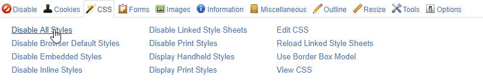
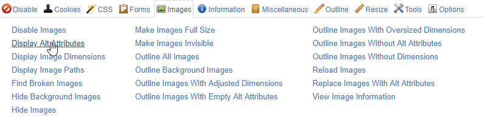
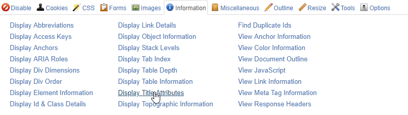

<header>
## Criterion 1.3 [A] For each [image conveying information](../../glossary.html#mImgInfo) with a [text alternative](../../glossary.html#mAltTexteImg), is this alternative relevant (except in [particular cases](../../particular-cases.html#cpCrit1-3 "Particular cases for criterion 1.3"))?
{: .article-header__title}
</header>

### Explanation

In order to be able to test this criterion you need to know what an image conveying information is.

Astuce
In order to know if an image is decorative or informative, hide it, take into account the context and ask yourself the question: 
**Did you lose any information?** 
If so, then this image conveys information.
{: .tip}

Important
* Always take into account the context.
* Try to avoid content redundancies.
{: .important}

#### Images that contain text

In this example, the image give an information in text form. In first time, let's check the context.
In this case the context does not give the same content as the image.
If we hide the image, we have lost informations. It is therefore necessary to add an alternative such as "101 things to do in London with kids".

#### Images that represent a scene or action

In this case, if the information is essential to understanding, you must describe it in the alternative text.

Context does not allow us to understand the meaning of images.
On the first image the alternative should be "Push down on the top of the cap to release the contents" and on the second "and mix the ingredients"

Important
It is important to remember that images do not necessarily have to be described in detail. Never extrapolate the meaning of the image. You must provide sufficient and necessary information.
{: .important}

#### Images that represent a graphic

In this case without alternative, it is impossible to distinguish between the telephone number and the fax number.
In any case, if the graphical display of a telephone is used, it is therefore necessary to provide the same information and therefore to provide an alternative.

### Tests

*   **Test 1.3.1:** Does each image (`img` tag) [conveying information](../../glossary.html#mImgInfo), with an `alt` attribute, meet the following conditions (except in [particular cases](../../particular-cases.html#cpCrit1-3 "Particular cases for criterion 1.3")):
    *   The `alt` attribute has a relevant value
    *   If present, the value of the `title` attribute matches the value of the `alt` attribute
    *   If present, the value of the `aria-label` property matches the value of the `alt` attribute
    *   If present, the content of the chunk of text linked via the `aria-labelledby` property matches the value of the `alt` attribute.
*   **Test 1.3.2:** Does each [area](../../glossary.html#mZone) (`area` tag), [conveying information](../../glossary.html#mImgInfo), and with an `alt` attribute, meet the following conditions (except in [particular cases](../../particular-cases.html#cpCrit1-3 "Particular cases for criterion 1.3")):
    *   The `alt` attribute has a relevant value
    *   If present, the value of the `title` attribute matches the value of the `alt` attribute
    *   If present, the value of the `aria-label` property matches the value of the `alt` attribute
    *   If present, the content of the chunk of text linked via the `aria-labelledby` property matches the value of the `alt` attribute.
*   **Test 1.3.3:** Does each [button](../../glossary.html#mBtnForm) associated with an image (`input` tag with the attribute `type="image"`), and with an `alt` attribute, meet the following conditions (except in [particular cases](../../particular-cases.html#cpCrit1-3 "Particular cases for criterion 1.3"))?
    *   The `alt` attribute has a relevant value
    *   If present, the value of the `title` attribute matches the value of the `alt` attribute
    *   If present, the value of the `aria-label` property matches the value of the `alt` attribute
    *   If present, the content of the chunk of text linked via the `aria-labelledby` property matches the value of the `alt` attribute.
*   **Test 1.3.4:** Does each [image object](../../glossary.html#image object) (`object` tag with the attribute `type="image/…"`), [conveying information](../../glossary.html#mImgInfo), meet one of the following conditions (except in [particular cases](../../particular-cases.html#cpCrit1-3 "Particular cases for criterion 1.3"))?
    *   The image object is immediately followed by an [adjacent link](../../glossary.html#mLienAdj) giving access to a page or a chunk of text containing a relevant alternative
    *   The user can replace the image object by a relevant text alternative, via a provided mechanism
    *   The user can replace the image object by an image with a relevant alternative, via a provided mechanism.
*   **Test 1.3.5:** Does each [image object](../../glossary.html#image object) (`object` tag with the attribute `type="image/…"`), [conveying information](../../glossary.html#mImgInfo), having an `aria-label` or an `aria-labelledby` property, or a `title` attribute, meet one of the following conditions (except in [particular cases](../../particular-cases.html#cpCrit1-3 "Particular cases for criterion 1.3"))?
    *   If present, the value of the `title` attribute matches the value of the `aria-label` property
    *   If present, the value of the `title` attribute matches the content of the chunk of text linked via the `aria-labelledby` property.
*   **Test 1.3.6:** Does each embedded image (`embed` tag with the attribute `type="image/…"`), [conveying information](../../glossary.html#mImgInfo), meet one of the following conditions (except in [particular cases](../../particular-cases.html#cpCrit1-3 "Particular cases for criterion 1.3"))?
    *   The embedded image is immediately followed by an [adjacent link](../../glossary.html#mLienAdj) giving access to a page or a chunk of text containing a relevant alternative
    *   The user can replace the embedded image by a relevant text alternative, via a provided mechanism
    *   The user can replace the embedded image by an image with a relevant alternative, via a provided mechanism.
*   **Test 1.3.7:** Does each embedded image (`embed` tag with the attribute `type="image/…"`), [conveying information](../../glossary.html#mImgInfo), meet the following conditions (except in [particular cases](../../particular-cases.html#cpCrit1-3 "Particular cases for criterion 1.3"))?
    *   If present, the value of the `title` attribute matches the value of the `aria-label` property
    *   If present, the value of the `title` attribute matches the content of the chunk of text linked via the `aria-labelledby` property.
*   **Test 1.3.8:** Does each vector image (`svg` tag) [conveying information](../../glossary.html#mImgInfo), and with no [alternative](../../glossary.html#alternative-svg), meet one of the following conditions (except in [particular cases](../../particular-cases.html#cpCrit1-3 "Particular cases for criterion 1.3")):
    *   The `svg` tag has a `role="img"` 
    *   The `svg` tag has an `aria-label` property with a relevant value, matching the `title` attribute of the `svg` tag, if present
    *   The `svg` tag has a `desc` tag with a relevant content, equal to the `title` attribute of the `svg` tag, if present.
*   **Test 1.3.9:** For each vector image (`svg` tag), [conveying information](../../glossary.html#mImgInfo), and with an alternative, is this alternative [correctly rendered](../../glossary.html#mCorrectlyRendered) by assistive technologies?
*   **Test 1.3.10:** Does each bitmap image (`canvas` tag) [conveying information](../../glossary.html#mImgInfo) meet one of the following conditions (except in [particular cases](../../particular-cases.html#cpCrit1-3 "Particular cases for criterion 1.3"))?
    *   The alternative content (between <canvas> and </canvas>) is relevant
    *   The bitmap image is immediately followed by an [adjacent link](../../glossary.html#mLienAdj) giving access to a page or a chunk of text containing a relevant alternative
    *   The user can replace the bitmap image by a relevant text alternative, via a provided mechanism
    *   The user can replace the bitmap image by an image with a relevant alternative, via a provided mechanism.
*   **Test 1.3.11:** Does each bitmap image (`canvas` tag), [conveying information](../../glossary.html#mImgInfo), meet the following conditions (except in [particular cases](../../particular-cases.html#cpCrit1-3 "Particular cases for criterion 1.3"))?
    *   If present, the value of the `title` attribute matches the value of the `aria-label` property
    *   If present, the value of the `title` attribute matches the content of the chunk of text linked via the `aria-labelledby` property.
*   **Test 1.3.12:** For each bitmap image (`canvas` tag), [conveying information](../../glossary.html#mImgInfo), and with an alternative (content between `<canvas>` and `</canvas>`), is this alternative [correctly rendered](../../glossary.html#mCorrectlyRendered) by assistive technologies?
*   **Test 1.3.13:** For each [image conveying information](../../glossary.html#mImgInfo) and with a [text alternative](../../glossary.html#mAltTexteImg), is the text alternative [short and concise](../../glossary.html#mAltCC) (except in [particular cases](../../particular-cases.html#cpCrit1-3 "Particular cases for criterion 1.3"))?

### How to test

#### Tests 1.3.1, 1.3.3

Tool(s): [[web developer bar](../tools.html#web-developer-bar)]

1. In the "CSS" menu, choose "Disable All Styles".
    
2. In the "Images" menu, choose "Display Alt Attributes".
    
3. In the "Information" menu, choose "Display Title Attributes".
    
4. In the "CSS" menu, choose "Edit CSS", and in the field at the bottom of the window, type `img,input{border:2px solid red}`.
5. For each image that is not a link (not outlined), or button associated to an image (`input type="image"`) with an `alt` attribute, conveying information, check:
    1. That the `alt` attribute is relevant;
    2. That the `title` attribute, if present, is identical to the `alt` attribute;
    3. That the `aria-label` attribute, if present, is identical to the `alt` attribute;
    4. That the chunk of text linked via the `aria-labelledby` property, if present, is identical to the `alt` attribute.

#### Test 1.3.2

*Todo*

#### Test 1.3.4, 1.3.5

*Todo*

#### Tests 1.3.6, 1.3.7

*Todo*

#### Test 1.3.8

Tool(s): [[web developer bar](../tools.html#web-developer-bar), Chrome inspector]

1.  In the "CSS" menu, choose "Disable All Styles".
    
2.  Right-click on the page and choose "Inspect".
3.  In the search field, type "svg".
4.  Spot the `svg` tags used to insert an image [conveying information](../../glossary.html#image-conveying-information)
5.  Right-click on the element and choose "Inspect Element".
6.  Check:
    *   The presence of the ARIA property `role="img"` on the `svg` tag and:
        1.  The presence of an `aria-label` property, identical to the `title` attribute if present, whose content allows to understand the nature and function of the image;
        2.  The presence of a `desc` tag, identical to the `title` attribute if present, whose content allows to understand the nature and purpose of the image.

#### Test 1.3.9

*Todo*

#### Tests 1.3.10, 1.3.11

*Todo*

#### Test 1.3.12

*Todo*

#### Test 1.3.13

*Todo*
